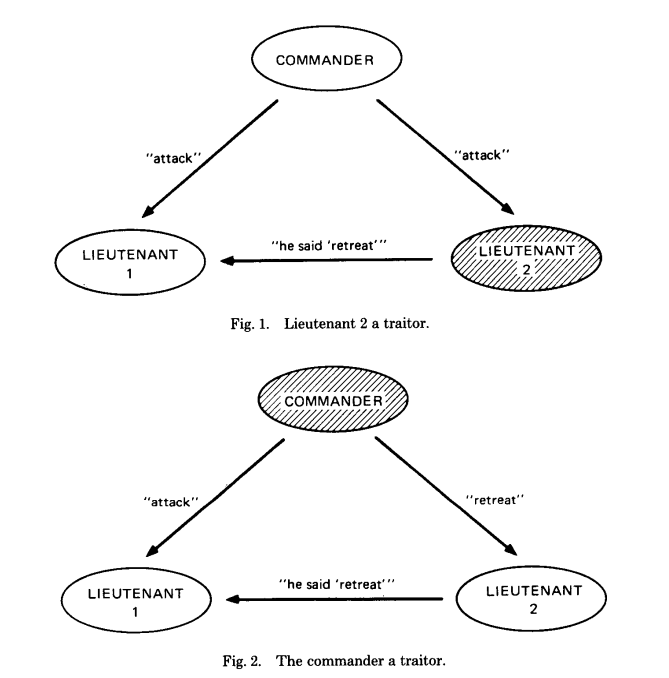

对 The Byzantine Generals Problem 论文原文的翻译和个人理解。

# 0. Abstraction

计算机系统的不同部分必须能正确处理冲突的信息，此问题可以被抽象为拜占庭将军问题。

拜占庭军队的将军们包围了敌方的一座城市，他们之间只能通过信使传递消息，将军们必须对战斗计划达
成一致（进攻或者撤退）。但将军当中有叛徒存在，会尝试干扰其他将军的判断，拜占庭将军问题就是要
找出一种算法，能确保忠诚将军的判断能达成一致。

可以证明的是，当信使只能口头传达信息时(即信使说的话不能鉴别真伪)，拜占庭将军问题只有在超过
2/3将军是忠诚将军时才有有解。当信使携带不可伪造的文字信息时，任意数量的将军和叛徒都有解。

# 1. INTRODUCTION

将军们各自率领军队驻扎在敌方城外，只能通过信使交流。将军们观察敌方后必须各自制定战斗计划(进攻
或者撤退)，但将军中存在叛徒，他们要阻止忠诚将军的战斗计划达成一致。为解决这个问题，将军们需要一种算法保证:

    A. 所有忠诚将军根据相同的行动计划决策
    B. 一小部分叛徒的存在不能导致忠诚将军最后采取不好的行动

条件B的表达是模糊的，到底多少叛徒才算是一小部分叛徒？到底哪种行动算不好的行动？如果3个将军中只
有1个叛徒，而两个忠诚将军一个认为该进攻，另一个认为该撤退，这时无论叛徒决策如何，我们都不能认为
最终结果是不好的。

一种直观的算法是让每个将军把自己观察敌军后得出的行动计划发送给其他所有将军，
每个忠诚将军收到的n - 1条信息是一样的，这样保证了条件A。然后所有将军以少数服从多数的原则选出最终行动计划，这样如果
只有少量叛徒，并不能干扰忠诚将军的决定，也就满足了条件B。

*(个人理解: 条件B很容易理解，但条件A乍一看不是很懂为什么要这样设定。现在的理解是，每个忠诚将军
首先会有自己观察得出的计划，最终决定还是要看所有其他将军的决定)*

但是，上述算法的条件A实际是不能满足的，因为叛徒可以随意发送消息，给不同的将军发送不同的消息，
这样忠诚将军得到的信息是不一样的。

设一共有 *n个* 将军，*v(i)* 代表
第 *i个* 将军的决定。为了满足条件A，下面的条件必须被满足:

    1. 每个忠诚将军必须获得同样的信息v(1)、v(2)...v(n)

条件1暗示 *v(i)* 不能直接被设置为从第 *i* 个
将军那里获得的信息（因为有叛徒给不同人发不同消息）。
所以可能使 *v(i)* 并不等于从第 *i* 个将军那里得到的消息。但如果要满足条件B，那这种考虑又是不必要的。
因为条件B已经说明不会因为部分叛徒的存在而导致最终决策错误，所以允许错误消息存在。
也因此我们对每一个 *i* 有如下要求:

    2. 如果第i个将军是忠诚的，那么他发出的消息会被其他忠诚将军使用，且记录为v(i)

我们可以重写条件1为，无论第 *i* 个将军是否忠诚，都有:

    1' 任意两个忠诚将军使用相同的v(i)

条件1'和条件2都只描述了单独第 *i* 个将军的情况。
我们可以进一步思考单独一个将军是如何把消息发出给其他将军的。
考虑有有一个指挥官(commanding general)和他的 *n - 1* 个副官(lieutenants)，产生如下问题:

拜占庭将军问题: 一个指挥官给 *n - 1* 个副官发送命令，且:

    IC1. 所有忠诚的副官都遵守相同的命令
    IC2. 如果指挥官是忠诚的，那么所有忠诚的副官都遵守他发送的指令

条件IC1.和IC2.被称为交互一致性条件(interactive consistency conditions)。
注意，如果指挥官是忠诚的，那么我们可以从IC2推导出IC1，但实际上指挥官未必忠诚。

为了解决原始的问题(满足条件A、B的问题)，第 *i* 个将军把他的*v(i)*值通过拜占庭将军问题的方式以命令发送给其他将军，命令内容是“以我发送的值作为*v(i)*”

# 2. IMPOSSIBILITY RESULTS

拜占庭将军问题看上去比较简单，但实际结论是令人惊讶的: 如果信息以口信的方式发送，则信息完全在传信人的控制下，这时必须有超过三分之二的忠诚将军才会有解。
举个例子，如果现在总共3位将军中有1位叛徒，那么此时无解，

