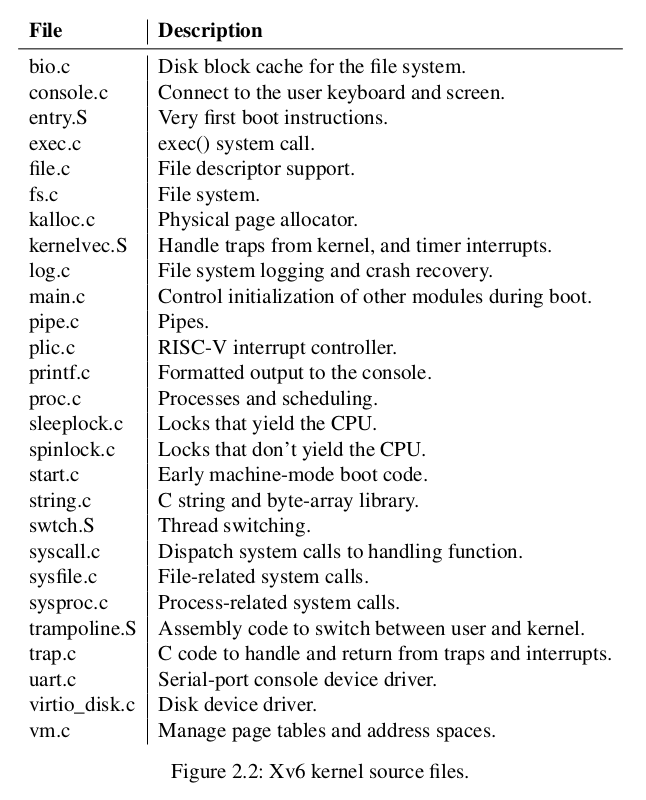
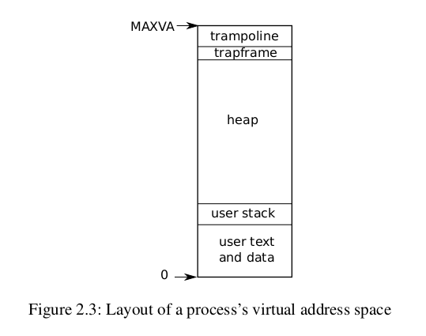

An operating system must fulfill three requirements: multiplexing, isolation, and interaction.

Xv6's low-level functionality (for example, its process implementation) is specific to RISC-V.

CPU是围绕一堆硬件工作的，这些硬件大多是I/O接口。在Xv6中，将由qemu模拟出这些硬件，比如RAM、ROM、串口等设备。

## 2.1 Abstracting physical resources

为了安全考虑，抽象出硬件资源，避免用户程序直接使用硬件。

## 2.2 User mode, supervisor mode, and system calls

CPU使用硬件支持用户程序和内核程序间的隔离。例如RISC-V有3种模式: machine mode，supervisor mode和user mode。 machine mode拥有所有权限，主要用来配置计算机。Xv6会在machine mode执行一些指令后变为supervisor mode。在supervisor mode下，CPU可以执行一些特权指令，比如开启/关闭中断，读写指向页表的寄存器。如果用户程序尝试执行特权指令，CPU会拒绝执行该指令，然后进入特权模式，用特权模式下的代码终止用户程序。

用户程序不能像普通函数调用一样来调用system call。而是由CPU提供了特殊指令使程序从用户空间进到内核空间，并跳转到由内核预先设置的entry point。RISC-V中该指令是ecall。进入内核后，内核程序会检查入参是否合法，再决定是否执行系统调用。进入内核后的entry point一定是由内核代码指定而不能是用户程序指定，否则用户程序可能将entry point设置为跳过验证入参的部分。

## 2.3 Kernel organization

宏内核： 将所有操作系统代码都运行在内核空间

微内核： 尽可能减少内核空间的代码，让部分操作系统代码运行在用户空间

Xv6是宏内核。

## 2.4 Code: xv6 organization

Xv6内核代码组织如图

## 2.5 Process overview

 页表是由硬件实现的，Xv6为每个进程维护一个私有的页表。用户程序地址空间从0开始，RISC-V指针有64位长，硬件在查找页表时只使用低39位，Xv6实际只使用低38位，因此最大地址 MAXVA为 $2^{38} - 1$​ ，空间共256GB

在地址空间顶部，保留了两个page，分别是trampoline和trapframe。Xv6用这两个page使用户程序进出内核空间。trampoline page包含进出内核的代码，trapframe page是保存/恢复用户程序状态的空间。

内核为每一个进程维护了许多信息，比如进程的页表、进程的内核栈和进程的运行状态。

每个进程有两个栈，一个用户栈一个内核栈，进程刚起时只有用户栈，进入内核后才使用内核栈。程序在内核空间时，用户栈的数据仍然保留在内存中，只是没有被使用。两个栈被分隔开使得当程序在用户栈崩溃时，仍然可以在内核栈执行指令。

进程通过$ecall$指令发起系统调用，$ecall$指令提升CPU权限并修改PC寄存器使其指向内核预定义的entry point。在entry point切换到内核栈并执行系统调用指令。系统调用执行完成后调用$sret$​指令返回。

线程给进程the illusion of its own CPU，Xv6一个进程只有一个线程，其他操作系统实现可能一个进程有多个线程

## 2.6 Code: starting xv6, the first process and system call

RISV-V计算机启动以后，初始化其自身，运行一段只读的程序boot loader。boot loader将Xv6内核加载进内存。然后在machine mode下，CPU执行_entry(kernel/entry.S:7) 下的代码。entry中代码设置一个栈，然后跳转到kernel/start.c中的start函数。start函数在机器模式下进行一些配置，且通过$mret$命令回到特权模式，并跳转到kernel/main.c中的main函数，main函数在进行一系列初始化设置后构造一个可用的用户进程struct proc ，proc中代码段内容是user/initcode.S，initcode.S调用$exec$​系统调用user/init.c开始运行shell。但是，并不是kernel/main.c构造好第一个用户进程后就立马开始运行shell程序，而是构造完成后交由kernel/proc.c的scheduler()处理。至此，用户可以在终端输入命令与操作系统进行交互。
