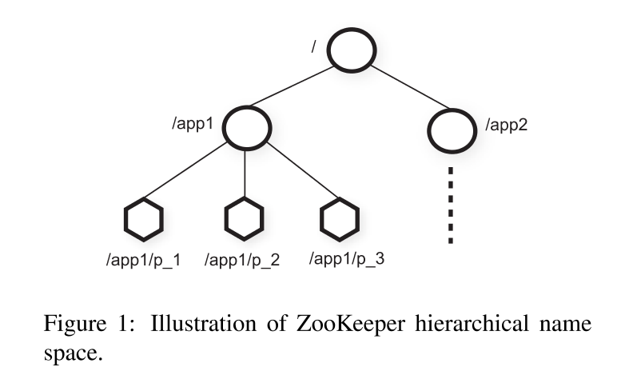

## ZooKeeper: Wait-free coordination for Internet-scale systems

### 1. Introduction

### 2. The ZooKeeper service

* znode ZooKeeper内存数据节点，按namespace继承关系组成的data tree

#### 2.1 Service overview

ZooKeeper暴露给client一套抽象的data nodes(znodes)，按namespace的层次性组织。

Client可以创建两种类型的znode

* Regular: Client显式地创建和删除znodes
* Ephemeral: Client创建这些节点，要么显式删除，要么等session结束被自动删除

​        每创建一个znode，client还会设置一个sequential flag。sequential flag单调递增地被追加到znode的名字后。如果n是新znode，p是其父节点，那么n的值不会比p的其他儿子节点的值更小。

​        ZooKeeper实现了watch机制用于提醒client数据变化。当client发起读请求且设置了watch flag，首先server正常回复，然后如果对应的值变了，server会再告诉client数据变了，但不回复数据本身的值，且这种提醒只提醒一次。

##### Data model

ZooKeeper的数据模型类似于文件系统，但并不真的存大量数据，只支持提供一些小数据作为配置或元数据使用

##### Sessions

Client连接到ZooKeeper后即开始一个新的session。session是有时间限制的，如果ZooKeeper在一定时间内没有收到用户请求，就认为client宕机，自动关闭session。session也可以被client主动关闭。

#### 2.2 Client API

##### create(path, data, flags)

##### delete(path, version)

##### exists(path, watch)

##### getData(path, watch)

##### setData(path, data, version)

##### getChildren(path, watch)

##### sync(path)

​        所有的API都有同步和异步的版本，ZooKeeper客户端保证异步的回调按顺序执行

​        注意ZooKeeper没有使用handle来访问znode，而是绝对路径，这样能简化实现，没有open()/close()这种API，同时不需要维护Path到handle的映射。所有的update方法都需要带上版本号，若版本号不符，server会报错

#### 2.3 ZooKeeper guarantees

ZooKeeper有两个基本的顺序保证

* Linearizable writes: 所有的修改请求都会被串行化
* FIFO client order: 所有来自一个client的请求会被按请求顺序来执行

